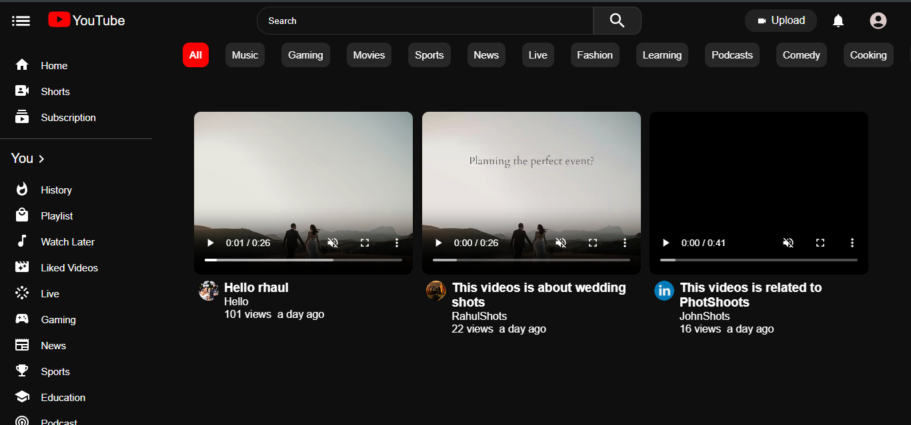
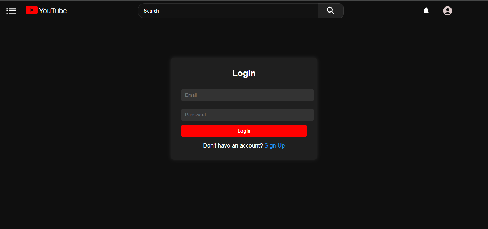
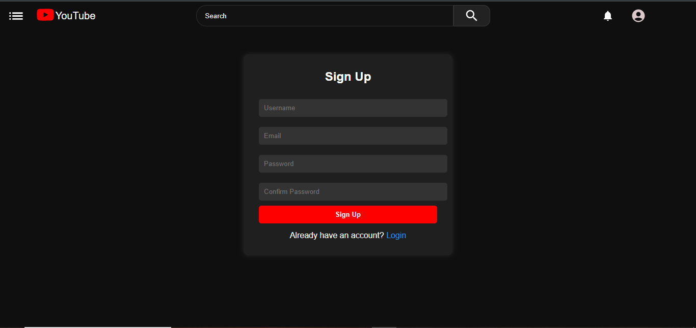
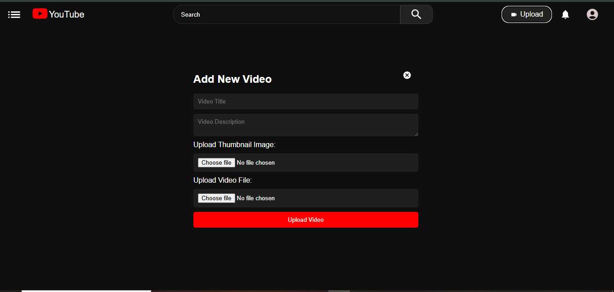
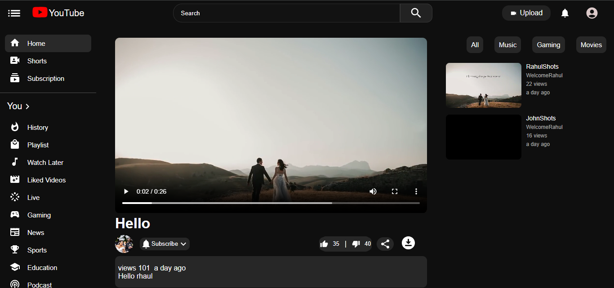

# YouTube Clone

[](https://github.com/RahulBelavadi/Youtube_Clone/stargazers)
[](https://github.com/RahulBelavadi/Youtube_Clone/network/members)
[](https://github.com/RahulBelavadi/Youtube_Clone/blob/main/LICENSE)

A full-stack YouTube clone built with React, Node.js, Express, and MongoDB that replicates core YouTube functionality including video streaming, comments, likes, and subscriptions.



## Features

- 🎥 Video upload and streaming
- 💬 Real-time comments and reply system
- 👍 Like/dislike videos
- 🔍 Search functionality
- 🔄 Suggested videos
- 📊 View count tracking

## Tech Stack

**Frontend:**
- React.js
- React Router
- Material-UI Icons
- Axios
- CSS3

**Backend:**
- Node.js
- Express
- MongoDB (with Mongoose)
- JWT Authentication
- Multer (for file uploads)

## Installation

1. **Clone the repository**
```bash
git clone https://github.com/RahulBelavadi/Youtube_Clone.git
cd Youtube_Clone
```

2. **Install dependencies**

```bash
# Install backend dependencies
cd Backend
npm install

# Install frontend dependencies
cd ../client
npm install
```

3. **Environment Setup**

Create a `.env` file in the `Backend` directory with:

```env
MONGO_URI=your_mongodb_connection_string
JWT_SECRET=your_jwt_secret_key
PORT=5000
```

4. **Run the application**

```bash
# Start the backend server (from Backend directory)
npm start

# Start the frontend (from client directory)
npm run dev
```

## Project Structure

```
Youtube_Clone/
├── client/               # Frontend React application
│   ├── public/           # Static files
│   ├── src/              # React components
│   │   ├── components/   # Reusable components
│   │   ├── context/      # Context providers
│   │   ├── pages/        # Page components
│   │   └── App.js        # Main App component
│   │   └── App.css       # Main App styling component
│   └── package.json      # Frontend dependencies
│
├── Backend/              # Backend Node.js server
│   ├── controllers/      # Route controllers
│   ├── models/           # MongoDB models
│   ├── routes/           # API routes
│   ├── uploads/          # Video storage
│   └── package.json      # Backend dependencies
└── README.md             # Project documentation
```

## API Endpoints

| Method | Endpoint                  | Description              |
|--------|---------------------------|--------------------------|
| POST   | /api/auth/register        | User registration        |
| POST   | /api/auth/login           | User login               |
| GET    | /api/videos               | Get all videos           |
| POST   | /api/videos               | Upload new video         |
| GET    | /api/videos/:id           | Get single video         |
| PATCH  | /api/videos/:id/view      | Increment view count     |
| PATCH  | /api/videos/:id/like      | Like a video             |
| POST   | /api/comments             | Add new comment          |
| GET    | /api/comments/:videoId    | Get video comments       |

## Screenshots

> **All screenshots are now organized in the `client/public` folder.**
> Paste your screenshot images in that folder and update the links below as needed.

| Feature/Page | Screenshot |
|--------------|------------|
| Home         |  |
| Login        |  |
| SignUp       |  |
| UploadVideo  |  |
| Videos       |  |

## Contributing

Contributions are welcome! Please follow these steps:

1. Fork the project
2. Create your feature branch (`git checkout -b feature/AmazingFeature`)
3. Commit your changes (`git commit -m 'Add some AmazingFeature'`)
4. Push to the branch (`git push origin feature/AmazingFeature`)
5. Open a Pull Request

## Contact

Rahul Belavadi  rahulbelavadi05@gmail.com

Project Link: https://github.com/RahulBelavadi/Youtube_Clone

## Technologies Used
- **MongoDB**: Database for user, video, and channel data
- **Express.js**: Backend API server
- **React.js**: Frontend SPA
- **Node.js**: Server runtime
- **JWT**: Authentication
- **Nodemailer**: Email for registration and password reset
- **MUI & React Icons**: UI components and icons

---

## License
This project is for educational purposes only.